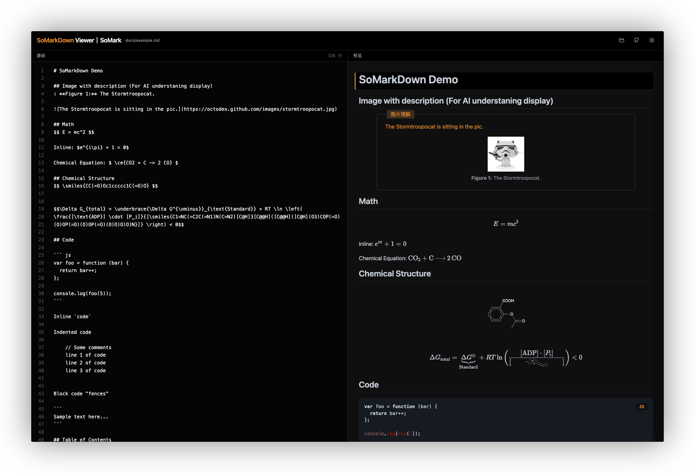

# SoMarkDown Viewer

[English](./README.md) ｜ 中文

[](https://github.com/SoMarkAI/SoMarkDownViewer/blob/main/LICENSE)

SoMarkDown Viewer 是 [SoMarkDown](https://github.com/SoMarkAI/SoMarkDown) 的一个 Web 应用，用于预览和渲染 SoMarkDown 文档。

在线体验：https://somark.tech/smd



SoMarkDown 是 Markdown 的超集，基于[markdown-it](https://github.com/markdown-it/markdown-it)开发，添加了对专业渲染方案的支持，如数学公式、化学结构式（SMILES）、代码语法高亮等。SoMarkDown 也是 [SoMark](https://somark.ai/) 文档智能解析产品的解析结果目标协议。

本 Viewer 项目不仅仅作为 SoMarkDown 文档预览工具，还提供了专业渲染器的交互功能，包括：
1. 实时编辑渲染 SoMarkDown 文档。
2. 逻辑对齐的双向同步滚动。
3. 双向点击对应位置跳转。

我们还提供了 Gradio 插件 [gradio-somarkdown](https://github.com/SoMarkAI/gradio_somarkdown)，可以替代 Gradio 中的 Markdown 组件。

## 安装

本项目采用完全原生的HTML、JS、CSS实现，启动方式简洁。

1. 克隆项目到本地：

```bash
git clone https://github.com/SoMarkAI/SoMarkDownViewer.git
cd SoMarkDownViewer
```

2. 获取最新的 SoMarkDown 的js、css文件：

```bash
# -k 静默执行
./get_latest_smd.sh
```

> 如果遇到了网络问题，可以手动到 [SoMarkDown 的 npm 包](https://www.jsdelivr.com/package/npm/somarkdown) 下载最新版本的 somarkdown.umd.min.js 和 somarkdown.css 文件，保存到 lib/somarkdown 目录下。

3. 采用一个HTTP服务器（如Python3的HTTPServer）启动项目。

```bash
# python 3.x
python3 -m http.server 8000
```

4. 在浏览器中打开 `http://localhost:8000` 即可查看和使用 SoMarkDown Viewer。

## 载入文件

Viewer 提供了多种方式载入 SoMarkDown 文件：

1. 直接在 URL 中指定文件的相对路径（相对于服务器启动路径），如 `http://localhost:8000?file=example.md`。
2. 点击页面上的 "打开文件" 按钮，选择本地文件。

## 许可证

MIT

